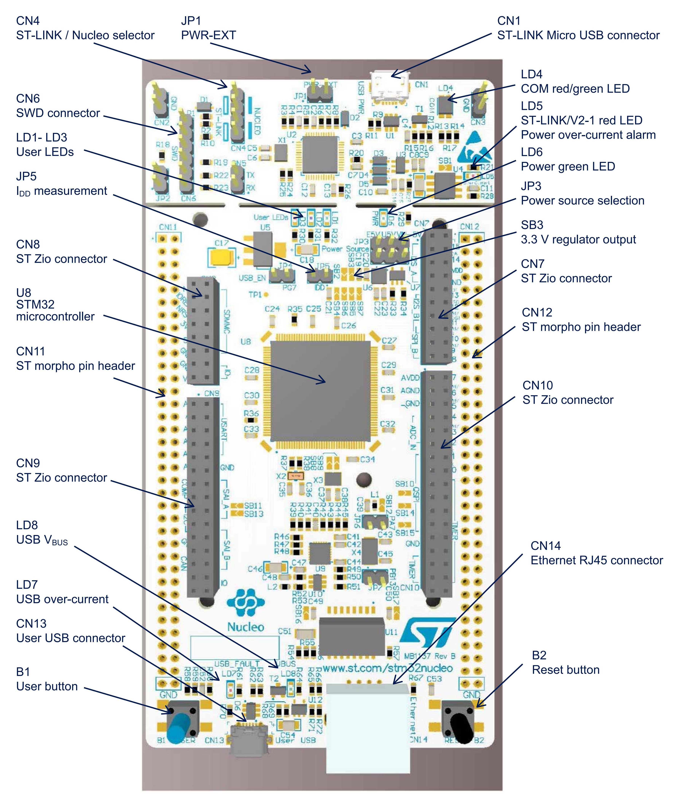

# STM32 Nucleo-144 BSP Introduction

This document records the instruction of the BSP (board support package) that provided by the RT-Thread development team for the STM32 Nucleo-144 development boards.

The document is covered in three parts:

- Resources Introduction
- Quickly Get Started
- Advanced Features

By reading the ***Quickly Get Started*** section developers can quickly get their hands on this BSP and run RT-Thread on the board. More advanced features will be introduced in the Advanced Features section to help developers take advantage of RT-Thread to drive more on-board resources.


## Resources Introduction

[](figures/stm32-nucleo-144.jpg) 

### Description 

The STM32 Nucleo-144 board provides an affordable and flexible way for users to try out new concepts and build prototypes by choosing from the various combinations of performance and power consumption features, provided by the STM32 microcontroller. For the compatible boards, the internal or external SMPS significantly reduces power consumption in Run mode. The ST Zio connector, which extends the ARDUINO® Uno V3 connectivity, and the ST morpho headers provide an easy means of expanding the functionality of the Nucleo open development platform with a wide choice of specialized shields. The STM32 Nucleo-144 board does not require any separate probe as it integrates the ST-LINK debugger/programmer. The STM32 Nucleo-144 board comes with the STM32 comprehensive free software libraries and examples available with the STM32Cube MCU Package.

### Features

- Common features
  - STM32 microcontroller in LQFP144 package 
  - 3 user LEDs
  - 2 user and reset push-buttons
  - 32.768 kHz crystal oscillator
  - Board connectors: 
    - SWD 
    - ST Zio expansion connector including ARDUINO® Uno V3
    - ST morpho expansion connector
  - Flexible power-supply options: ST-LINK, USB VBUS or external sources
  - On-board ST-LINK debugger/programmer with USB re-enumeration capability: mass storage, Virtual COM port, and debug port
  - Comprehensive free software libraries and examples available with the STM32Cube MCU Package
  - Support of a wide choice of Integrated Development Environments (IDEs) including IAR™, Keil®, and STM32CubeIDE
- Board-specific features
  - External or internal SMPS to generate Vcore logic supply
  - Ethernet compliant with IEEE-802.3-2002
  - USB OTG full speed or device only
  - Board connectors: 
    - USB with Micro-AB or USB Type-C™ 
    - Ethernet RJ45
  - Arm® Mbed Enabled™ compliant

### **For more details about these boards, please refer to [ST Nucleo Official Website](https://www.st.com/en/evaluation-tools/stm32-nucleo-boards.html?querycriteria=productId=LN1847).**


## Quickly Get Started

This BSP provides MDK4, MDK5, and IAR projects for developers and it supports the GCC development environment. Here's an example of the MDK5 development environment, to introduce how to run the system.



### Hardware connection

Use a Type-A to Mini-B cable to connect the development board to the PC and turn on the power switch. The LD3 (PWR) and LD1 (COM) will light.

### Compile and Download

- Double-click the `project.uvprojx` file to open the MDK-Keil5 project  (**NOT** `template.uvprojx` file)
- Click the “option for target” button
  - Debug: Choose "ST-LINK Debugger" and Click "Setting" button:
    - Port: choose "SW (Serial Wire)"
    - Flash Download: check "Reset and Run"

- Compile and download the program to the board

### Running Results

After the program is successfully downloaded, the system runs automatically. Observe the running results of the LED on the development board, the LD3 and LD1 will light all the time, and LD2 will flash periodically.

The USB virtual COM port connects to **USART3 by default**, and when the corresponding serial port (**115200-8-1-N**) is opened in the terminal tool, the output information of RT-Thread can be seen when the device is reset:

```shell
 \ | /
- RT -     Thread Operating System
 / | \     4.0.0 build Dec 21 2018
 2006 - 2018 Copyright by rt-thread team
msh >
```

### Terminal tool - PuTTy 

If you don't have a terminal tool software available, you can download *PuTTy*:

>  https://www.chiark.greenend.org.uk/~sgtatham/putty/latest.html


Follow these tutorial videos to learn PuTTy:

> https://www.youtube.com/watch?v=ab4ilbsteWU
>
> https://www.youtube.com/watch?v=dO-BMOzNKcI


## Advanced Features

This BSP only enables GPIO and USART3 by default. If you need more advanced features such as SPI, I2C, you need to configure the BSP with RT-Thread [ENV tool](https://www.rt-thread.io/download.html?download=Env) , as follows:

1. Open the Env tool under the specific BSP folder;
2. Enter `menuconfig` command to configure the project, then save and exit;
3. Enter `pkgs --update` command to update the package;
4. Enter `scons --target=mdk4/mdk5/iar` command to regenerate the project.

Learn how to use RT-Thread Env, click [Here](https://github.com/RT-Thread/rt-thread/blob/master/documentation/env/env.md).


## Translated & Maintained By

Cathy Lee @ RT-Thread Team

> https://github.com/Cathy-lulu
>
> contact@rt-thread.org

Meco Man @ RT-Thread Community

> jiantingman@foxmail.com 
>
> https://github.com/mysterywolf